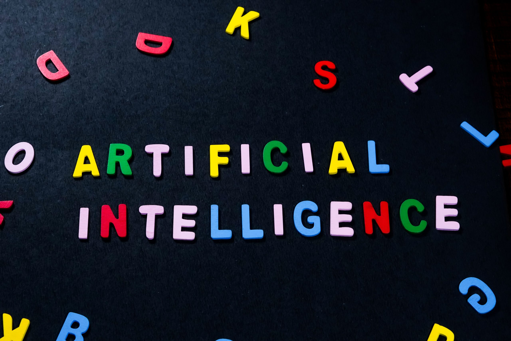

__Artificial Intelligence (AI)__ is the key to your career. For entrepreneurs & businessmen, it is the most important factor for their business growth. AI has already revolutionized the world and augmented many sectors. Students and working professionals need to focus on the __best AI courses__ as there is a huge demand for qualified AI professionals in every industry. 

<!--truncate-->

The __implementation of AI in business__ has brought a big change in the business strategy. This is going to be the new definition for every business – big corporate companies to small businesses. The business needs robust solutions to deal with digital savvy customers in this modern digital era. Gartner says, about 30 percent of all the B2B companies will be employing AI to boost at least one of their sales processes. 

This article will cover two aspects of AI – important of AI in business and why AI is important for career growth. 

### Importance of AI in Business

Many businesses aim to implement the right technology stack or solutions to enhance their productivity and reduce the operational costs. However, the technology adoption is equally important in the field for customer relationship management (CRM). The implementation of AI in business will help to achieve all the aspects. Smart technologies including Machine Learning (ML) & Natural Language Processing (NLP) help businesses thrive. By leveraging these technologies, companies and entrepreneurs get the best benefits. The guidance of the industry or domain experts is highly essential for business, else the implementation without proper sound knowledge could adversely affect the business process. Industry consultants and AI experts at [**Saaragh Technologies**](https://www.saaragh.com/).could help you in finding the __best software solutions for your business__.

Let’s have a look at the benefits of implementing AI in business: 

__Define Business Insights__

The core aspect of the business is to understand the data and get actionable insights. Using AI technology, business insights can be generated. Artificial Intelligence powered solutions convert information into knowledge and it is useful in defining the insights related to the business. Predication & forecast will save ample time and money. It will also help you to develop the __best business strategy or digital transformation roadmap for your business__. 

__Check Errors__

Businesses suffer huge losses due to human errors. It costs millions across the world to businesses. There is a huge difference between a manufacturing process and smart manufacturing process. The smart industries power by AI solutions are not only organizing the processes but also rectifying errors. By implementing the right technology, manufacturers can achieve zero defect products. Industry 4.0 with the power of AI can help business to take a big leap in suppressing critical errors and optimizing the entire process. 

__Customer Experience & Customer Relationship Management (CRM)__

Serving customers and matching their expectations is the hardest job for any business. Many companies aim to have the best CRM solutions that support their business and help them in retaining customers. AI powered apps are impactful in getting the attention of the customers and chalking out the __best CRM strategies__ for your business. AI powered solutions will help you boost sales and increase consumer loyalty. Industry leaders and experts opine that the implementation of AI solutions in sales & CRM will have a big impact on the sales & CRM strategy. 

The implementation of AI in business processes will bring value to your business and organization. For big companies and businesses, AI powered solutions are the need of the hour. 

__AI courses for career development__

There is a huge demand for AI professionals across the world. Companies have been adopting the ever-changing technologies to face the tough competition. For this, companies have also been aiming at hiring skilled professionals to meet their requirements and deliver the best solutions to their customers. However, despite the impact of COVID-19, there huge is a demand for AI courses and professionals.

Industry leaders and experts opine that USA will be replaced by automation and robots by 2030. Apps developed by the __best software companies__ aim to integrate AI in their technology stack. 

AI teaches machines to build solutions and services like human beings. The core aspect of AI implementation is automation. However, with the rise of the AI in business services there would be a higher demand for AI courses for working professionals. 

In IT industry, developers or engineers need to fine tune their skills every time. Many professionals aim to become AI engineers with in-depth practical and theoretical knowledge. AI certification programs offered by esteemed institutions will help IT professionals to enhance their skills and become the leaders in the IT market. 

IT processionals & fresh Engineering Graduates need to focus on the following aspects: 

__Coding Skills__: Professionals and even freshers in the IT industry must have the best coding skills to develop robust apps. To become __AI engineers__ they must be proficient in programming languages like __R, Python, C++__ and __Java__. 

__Natural Language Processing (NLP)__: In the field of artificial intelligence, NLP is the core sub-field. This helps machines and computers to understand our language. Along with the best understanding of NLP, AI engineers must also have a good command and understanding of NLTK and Gensim libraries. 

__AI Certification Program__: Students need to get a certification one of from the best professional institutes. This certification will help them achieve desired career opportunities. Besides, they need to have a better understanding of the AI certification course and its syllabus. IT professional can also focus on the areas in which they are already working and see how the certification will help them take the next big step in their career. 

__Industry Knowledge__: Besides the technical skills, IT professional must have sound industry knowledge that will help in developing better software applications. There is a huge demand for consultants in the IT market because of their expertise and a grip of their domain.  

__Communication Skills__: Along with technical skills, communication skills are essential for career growth. In the IT industry, Software developers and engineers need to interact with clients to understand their requirements. For this, they need to have good communication skills. 

Artificial Intelligence is the key to faster growth of any business. The solutions powered by AI support, optimise and streamline business processes. Robust solutions powered by AI will have a direct impact and help organizations redefine business in many ways. If you are looking for a career growth then you need to opt for the best certification, training and courses in the field of artificial intelligence and machine learning. Take the first step to a promising career in AI by signing up on [**app.nowa.ai**](https://app.nowa.ai/) for free! Discover courses on AI, ML, and Data Science, work on projects and get certified. 

